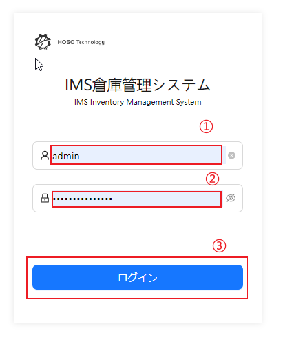
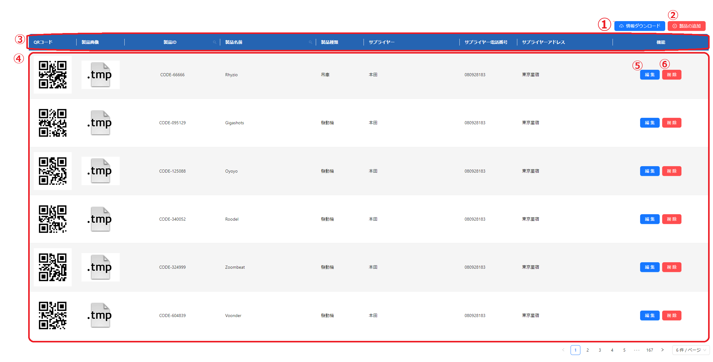
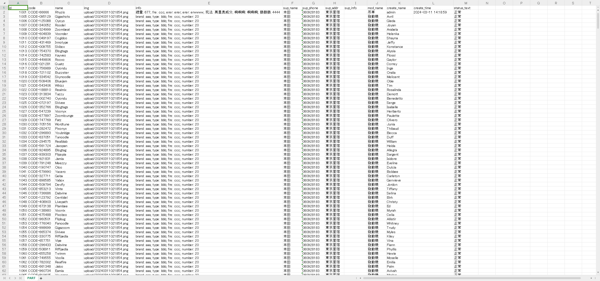
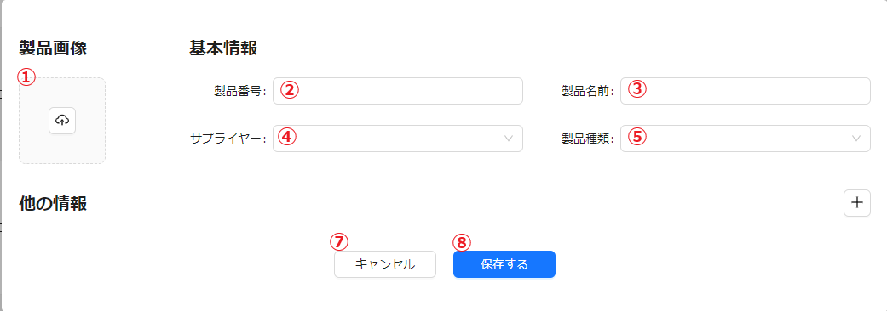
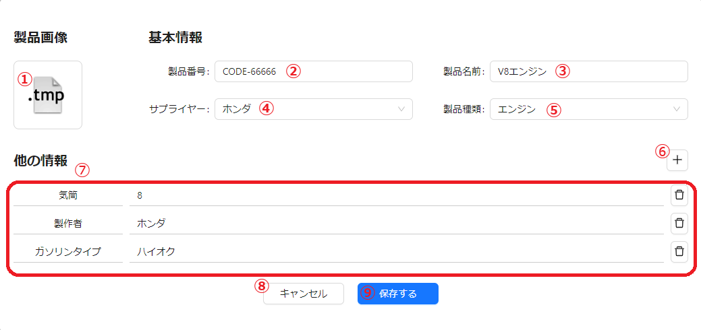
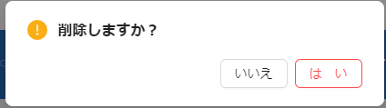
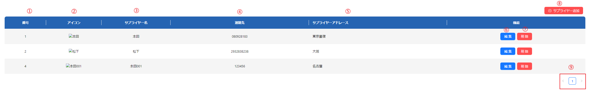
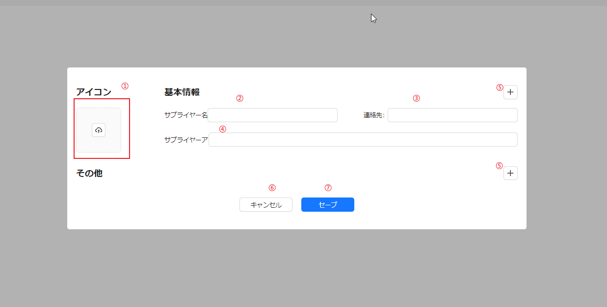
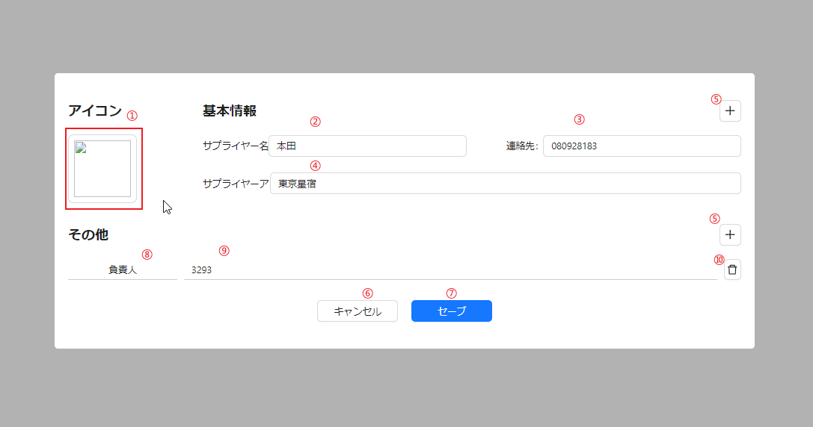
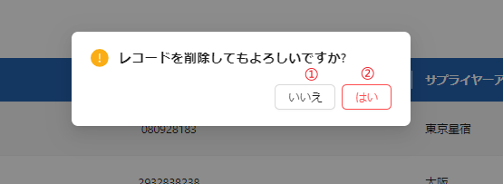

# 0. 初期化

# 1. 登録

## 機能

| id  |    説明    |
| :-- | :------: |
| ①   | ユーザー名入力ボックス |
| ②   | パスワード入力ボックス |
| ③   | ログインボタン |

### 登録

1. ①に　ユーザー名を入力
2. ②に　パスワードを入力
3. ③をクリック

# 2. 基本情報管理
## 2.1. 営業所管理
## 2.2. 現場管理
## 2.3. ユーザー管理

## 2.4. 製品管理
製品リスト：

#### ①：製品情報をxlsxに導出してダウンロードする
#### ②：製品情報を追加（製品情報を入力するUIを表示、詳しくは2.4.2へ）
#### ③：テーブルヘッダー
#### ④：情報をリストで表示
#### ⑤：製品情報を編集（製品情報を入力するUIを表示、詳しくは2.4.3へ）
#### ⑥：製品情報を削除（詳しくは2.4.4へ）

### 2.4.1.　①：製品情報をxlsxに導出してダウンロードする
このボタンを押すと画像のようにデーターを導出してダウンロードできる

### 2.4.2.　②：製品情報を追加
このボタンを押すと製品情報を入力するUIが表示される

#### ①：画像をアプロード
#### ②：製品番号を入力
#### ③：製品名前を入力
#### ④：サプライヤーをドロップダウンメニューで選択
#### ⑤：製品種類をドロップダウンメニューで選択
#### ⑥：他の情報を追加（詳しくは2.4.3の⑦ へ）
#### ⑦：保存せずにUIを消す
#### ⑧：保存してUIを消す

### 2.4.3.　⑤：製品情報を編集
このボタンを押すと製品情報を入力するUIが表示される

#### ①：画像をアプロード
#### ②：製品番号を入力
#### ③：製品名前を入力
#### ④：サプライヤーをドロップダウンメニューで選択
#### ⑤：製品種類をドロップダウンメニューで選択
#### ⑥：他の情報を追加（押すと⑦に1行追加する）
#### ⑦：他の情報を入力（左は情報名、右は情報内容）
#### ⑧：保存せずにUIを消す
#### ⑨：保存してUIを消す

### 2.4.4.　⑥：製品情報を削除
このボタンを押すと確認メッセージが表示され、はいを押すと指定された記録が削除される。
確認メッセージの画像：

## 2.5. 種類設定

## 2.6. サプライヤー管理

サプライヤー関連の基本情報展示・管理

### 2.6.1. メインページ

#### 機能一覧

| id  |     説明      |
| :-- | :---------: |
| ①   | サプライヤーデータ番号 |
| ②   | サプライヤーアイコン  |
| ③   |   サプライヤー名   |
| ④   |  サプライヤー連絡先  |
| ⑤   | サプライヤーアドレース |
| ⑥   |  データ編集ボタン   |
| ⑦   |  データ削除ボタン   |
| ⑧   | サプライヤー追加ボタン |
| ⑨   |  ページネーション   |

### 2.6.2 サプライヤー追加

*2.6.1の⑧をクリックして、サプライヤー追加ダイアログを開く*

| id  |          説明           |
| :-- | :-------------------: |
| ①   | サプライヤー　アイコンアップロード　ボタン |
| ②   |      サプライヤー名を入力       |
| ③   |     サプライヤー連絡先を入力      |
| ④   |    サプライヤーアドレースを入力     |
| ⑤   |        その他を追加         |
| ⑥   |       キャンセルボタン        |
| ⑦   |        セーブボタン         |

### 2.6.3. データ編集
*2.6.1の⑥をクリックして、データ編集ダイアログを開く*

| id  |            説明             |
| :-- | :-----------------------: |
| ①   | サプライヤー　アイコン　削除・アップロード　ボタン |
| ②   |        サプライヤー名を入力         |
| ③   |       サプライヤー連絡先を入力        |
| ④   |      サプライヤーアドレースを入力       |
| ⑤   |          その他を追加           |
| ⑥   |         キャンセルボタン          |
| ⑦   |          セーブボタン           |
| ⑧   |        その他　keyを入力         |
| ⑨   |       その他　valueを入力        |
| ⑩   |          その他を削除           |

### 2.6.4. データ削除
*2.6.1の⑦をクリックして、データ削除ダイアログを開く*

| id  |            説明             |
| :-- | :-----------------------: |
| ①   | サプライヤー削除をキャンセル |
| ②   |        サプライヤー削除を確認         |

## 2.7. 倉庫管理

# 3.  部品管理
## 3.1. 在庫管理
## 3.2. 入出庫管理
## 3.3. 入出庫レビュー