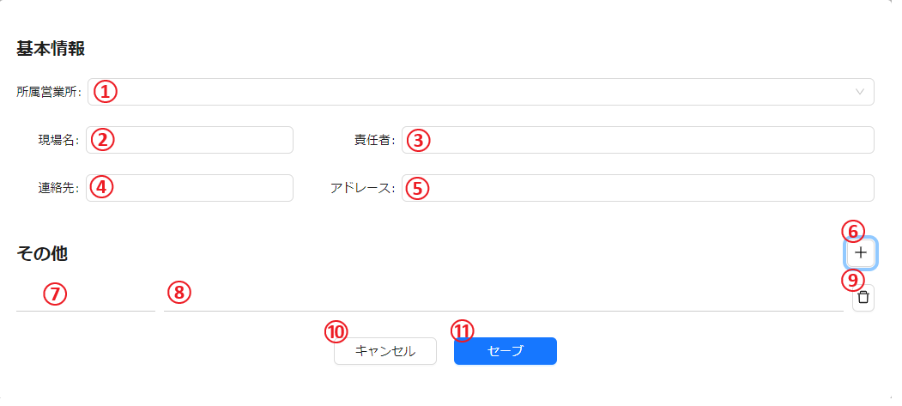
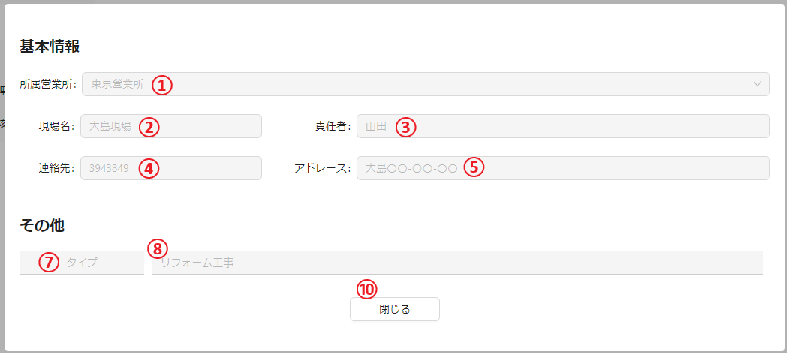
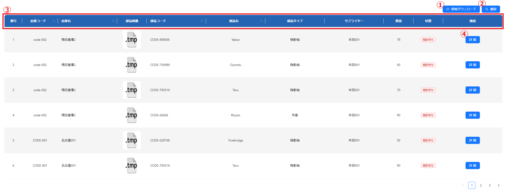
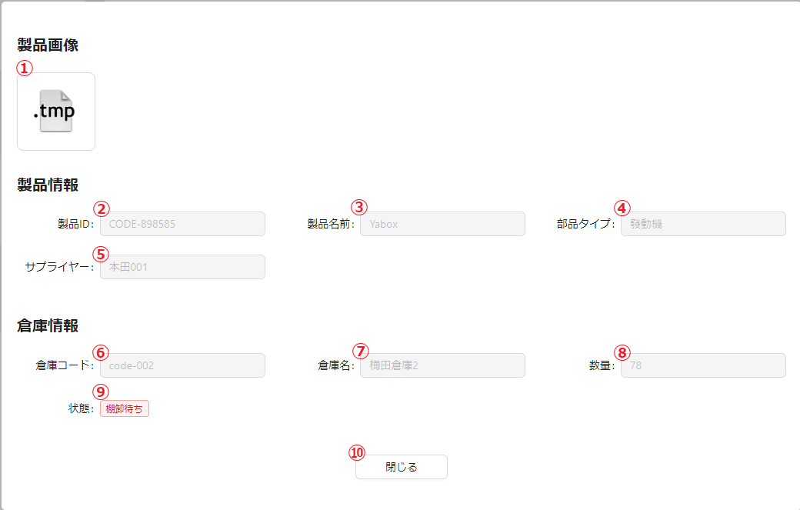

# 目次
<!-- no toc -->
- [0. 初期化](#0)
- [1. ログイン](#1)
- [2. 基本情報管理](#2)
  * [2.1. 営業所管理](#21)
    + [2.1.1. 営業所を追加（①）、編集（④）、詳細の表示（③）](#211)
    + [2.1.2 ②：テーブルヘッダー（検索）](#212)
    + [2.1.3 ⑤:営業所を削除](#213)
  * [2.2. 現場管理](#22)
    + [2.2.1. 現場を追加、編集、詳細の表示](#221)
    + [2.2.2 ②：テーブルヘッダー（検索）](#222)
    + [2.2.3 ⑤:現場を削除](#223)
  * [2.3. ユーザー管理](#23)
    + [2.3.1. ユーザーを追加、編集](#231)
    + [2.3.2 ②：テーブルヘッダー（検索）](#232)
    + [2.3.3 ⑤:ユーザーを削除](#233)
  * [2.4. 製品管理](#24)
    + [2.4.1.　①：製品情報をxlsxに導出してダウンロードする](#241)
    + [2.4.2.　製品情報を追加（①）、編集（⑤）](#242)
    + [2.4.3. ③：テーブルヘッダー（検索）](#243)
    + [2.4.4.　⑥：製品情報を削除](#244)
  * [2.5. 種類設定](#25)
  * [2.6. サプライヤー管理](#26)
  * [2.7. 倉庫管理](#27)
- [3. 部品管理](#3)
  * [3.1. 在庫管理](#31)
  * [3.2. 入出庫管理](#32)
  * [3.3. 入出庫レビュー](#33)

# 0. 初期化

# 1. ログイン

| id  |    説明    |
| :-- | :------: |
| ①   | ユーザー名入力ボックス |
| ②   | パスワード入力ボックス |
| ③   | ログインボタン |

## 1.1 ログイン手順
1. ①に　ユーザー名を入力
2. ②に　パスワードを入力
3. ③をクリック

# 2. 基本情報管理

## 2.1. 営業所管理

営業所リスト：

| id  |     説明      |
| :-- | :---------: |
| ①   | 営業所を追加（詳しくは[2.1.1](#211)へ）|
| ②   | テーブルヘッダー（検索） (詳しくは[2.1.2](#212)へ)|
| ③   | 営業所の詳細を表示（詳しくは[2.1.1](#211)へ）  |
| ④   | 営業所の情報を編集 （詳しくは[2.1.1](#211)へ） |
| ⑤   | 営業所を削除（詳しくは[2.1.3](#213)へ） |

### 2.1.1. 営業所を追加（①）、編集（④）、詳細の表示（③）

この三つのボタン全部同じポップアップウィンドウが表示される。\
追加する場合は空っぽポップアップウィンドウ。\
編集する場合は指定されたレコードのデーターが入力フィールドに入る。\
詳細を表示する場合は編集と同じで、入力フィールドが編集できない状態になる。\

追加ボタンを押すと以下のポップアップウィンドウが表示される

編集ボタンを押すと以下のポップアップウィンドウが表示される

詳細ボタンを押すと以下のポップアップウィンドウが表示される

| id  |     説明      |
| :-- | :---------: |
| ①   | 営業所の名前を入力 |
| ②   | 営業所のアドレースを入力 |
| ③   | 営業所の連絡先を入力   |
| ④   | 他の情報を追加（押すとその他に1行追加する）   |
| ⑤   | 情報名|
| ⑥   | 情報内容   |
| ⑦   | 行を削除する   |
| ⑧   | 保存せずにポップアップウィンドウを消す   |
| ⑨   | 保存してポップアップウィンドウを消す |

### 2.1.2 ②：テーブルヘッダー（検索）

カラム名を表示する。\
がついているカラムをクリックしたら検索できる。\

下記は検索できるカラム
- 営業所
- アドレース 
- 連絡先

### 2.1.3 ⑤:営業所を削除

このボタンを押すと確認メッセージが表示され、はいを押すと指定された記録が削除される。\
確認メッセージの画像：\

## 2.2. 現場管理
現場リスト：

| id  |     説明      |
| :-- | :---------: |
| ①   | 現場のを追加（詳しくは[2.2.1](#221)へ）|
| ②   | テーブルヘッダー（検索） (詳しくは[2.2.2](#222)へ)|
| ③   | 現場の詳細を表示（詳しくは[2.2.1](#221)へ）  |
| ④   | 現場の情報を編集 （詳しくは[2.2.1](#221)へ） |
| ⑤   | 現場を削除（詳しくは[2.2.3](#223)へ） |

### 2.2.1. 現場を追加（①）、編集（④）、詳細の表示（③）

この三つのボタン全部同じポップアップウィンドウが表示される。\
追加する場合は空っぽポップアップウィンドウ。\
編集する場合は指定されたレコードのデーターが入力フィールドに入る。\
詳細を表示する場合は編集と同じで、入力フィールドが編集できない状態になる。\

追加ボタンを押すと以下のポップアップウィンドウが表示される

編集ボタンを押すと以下のポップアップウィンドウが表示される

詳細ボタンを押すと以下のポップアップウィンドウが表示される

| id  |     説明      |
| :-- | :---------: |
| ①   | 所属営業所をドロップダウンメニューで選ぶ（[営業所管理ページ](#21)で追加、編集、削除） |
| ②   | 現場の名前を入力 |
| ③   | 責任者の名前を入力   |
| ④   | 現場の連絡先を入力   |
| ⑤   | 現場のアドレース|
| ⑥   | その他に一行追加   |
| ⑦   | 情報名を入力   |
| ⑧   | 情報内容を入力  |
| ⑨   | 行を削除  |
| ⑩   | 保存せずにポップアップウィンドウを消す   |
| ⑪   | 保存してポップアップウィンドウを消す |

### 2.2.2 ②：テーブルヘッダー（検索）

カラム名を表示する。\
がついているカラムをクリックしたら検索できる。\

下記は検索できるカラム
- 所属営業所
- 現場名
- アドレース  
- 連絡先

### 2.2.3 ⑤:現場を削除

このボタンを押すと確認メッセージが表示され、はいを押すと指定された記録が削除される。\
確認メッセージの画像：\

## 2.3. ユーザー管理
ユーザーリスト：

| id  |     説明      |
| :-- | :---------: |
| ①   | ユーザーを追加（詳しくは[2.3.1](#221)へ）|
| ②   | テーブルヘッダー（検索） (詳しくは[2.3.2](#222)へ)|
| ③   | ユーザーを編集 （詳しくは[2.3.1](#221)へ） |
| ④   | ユーザーを削除（詳しくは[2.3.3](#223)へ） |

### 2.3.1. ユーザーを追加（①）、編集（③）

この二つのボタン全部同じポップアップウィンドウが表示される。\
追加する場合は空っぽポップアップウィンドウ。\
編集する場合は指定されたレコードのデーターが入力フィールドに入る。\

追加ボタンを押すと以下のポップアップウィンドウが表示される

編集ボタンを押すと以下のポップアップウィンドウが表示される

| id  |     説明      |
| :-- | :---------: |
| ①   | 所属営業所をドロップダウンメニューで選ぶ（[営業所管理ページ](#21)で追加、編集、削除） |
| ②   | ログイン用のアカウントを入力 |
| ③   | ユーザーの氏名を入力   |
| ④   | ログイン用のパスワードを入力   |
| ⑤   | このシステムでの役割をドロップダウンメニューで選ぶ（システム、倉庫、仕入れ、レビュー）|
| ⑥   | 保存せずにポップアップウィンドウを消す   |
| ⑦   | 保存してポップアップウィンドウを消す |

### 2.3.2 ②：テーブルヘッダー（検索）

カラム名を表示する。\
がついているカラムをクリックしたら検索できる。\

下記は検索できるカラム
- 所属営業所
- アカウント
- 氏名  

### 2.3.3 ⑤:ユーザーを削除

このボタンを押すと確認メッセージが表示され、はいを押すと指定された記録が削除される。\
確認メッセージの画像：\

## 2.4. 製品管理

製品リスト：

| id  |     説明      |
| :-- | :---------: |
| ①   | 製品情報をxlsxに導出してダウンロード （詳しくは[2.4.1](#241)へ）|
| ②   | 製品情報を追加（詳しくは[2.4.2](#242)へ） |
| ③   | テーブルヘッダー（検索）（詳しくは[2.4.3](#243)へ）   |
| ④   | 情報リスト  |
| ⑤   | 製品情報を編集（詳しくは[2.4.1](#241)へ） |
| ⑥   | 製品情報を削除（詳しくは[2.4.4](#244)へ）   |

### 2.4.1.　①：製品情報をxlsxに導出してダウンロードする

このボタンを押すと画像のようにデーターを導出してダウンロードできる

### 2.4.2.　製品情報を追加（①）、編集（⑤）

この二つのボタン全部同じポップアップウィンドウが表示される。\
追加する場合は空っぽポップアップウィンドウ。\
編集する場合は指定されたレコードのデーターが入力フィールドに入る。\

追加ボタンを押すと以下のポップアップウィンドウが表示される

編集ボタンを押すと以下のポップアップウィンドウが表示される

| id  |     説明      |
| :-- | :---------: |
| ①   | 画像をアプロード |
| ②   | 製品番号を入力 |
| ③   |   製品名前を入力   |
| ④   |  サプライヤーをドロップダウンメニューで選択（[サプライヤー管理ページ](#26)で追加、編集、削除）  |
| ⑤   | 製品種類をドロップダウンメニューで選択（[種類設定ページ](#25)で追加、編集、削除） |
| ⑥   |  他の情報を追加（押すと⑦に1行追加する）   |
| ⑦   |  他の情報を入力（左は情報名、右は情報内容、で削除）   |
| ⑧   | 保存せずにポップアップウィンドウを消す |
| ⑨   |  保存してポップアップウィンドウを消す   |

### 2.4.3. ③：テーブルヘッダー（検索）

カラム名を表示する。\
虫眼鏡アイコンがついているカラムをクリックしたら検索できる。

### 2.4.4.　⑥：製品情報を削除

このボタンを押すと確認メッセージが表示され、はいを押すと指定された記録が削除される。\
確認メッセージの画像：\

## 2.5. 種類設定
<!-- TODO -->

## 2.6. サプライヤー管理
サプライヤー関連の基本情報展示・管理

### 2.6.1. メインページ

#### 機能一覧

| id  |     説明      |
| :-- | :---------: |
| ①   | サプライヤーデータ番号 |
| ②   | サプライヤーアイコン  |
| ③   |   サプライヤー名   |
| ④   |  サプライヤー連絡先  |
| ⑤   | サプライヤーアドレース |
| ⑥   |  データ編集ボタン   |
| ⑦   |  データ削除ボタン   |
| ⑧   | サプライヤー追加ボタン |
| ⑨   |  ページネーション   |

### 2.6.2 サプライヤー追加

*2.6.1の⑧をクリックして、サプライヤー追加ダイアログを開く*

| id  |          説明           |
| :-- | :-------------------: |
| ①   | サプライヤー　アイコンアップロード　ボタン |
| ②   |      サプライヤー名を入力       |
| ③   |     サプライヤー連絡先を入力      |
| ④   |    サプライヤーアドレースを入力     |
| ⑤   |        その他を追加         |
| ⑥   |       キャンセルボタン        |
| ⑦   |        セーブボタン         |

### 2.6.3. データ編集

*2.6.1の⑥をクリックして、データ編集ダイアログを開く*

| id  |            説明             |
| :-- | :-----------------------: |
| ①   | サプライヤー　アイコン　削除・アップロード　ボタン |
| ②   |        サプライヤー名を入力         |
| ③   |       サプライヤー連絡先を入力        |
| ④   |      サプライヤーアドレースを入力       |
| ⑤   |          その他を追加           |
| ⑥   |         キャンセルボタン          |
| ⑦   |          セーブボタン           |
| ⑧   |        その他　keyを入力         |
| ⑨   |       その他　valueを入力        |
| ⑩   |          その他を削除           |

### 2.6.4. データ削除

*2.6.1の⑦をクリックして、データ削除ダイアログを開く*\

| id  |            説明             |
| :-- | :-----------------------: |
| ①   | サプライヤー削除をキャンセル |
| ②   |        サプライヤー削除を確認         |

## 2.7. 倉庫管理

### 2.7.1. メインページ

#### 機能一覧

| id  |    説明    |
| :-- | :------: |
| ①   | 倉庫データ番号  |
| ②   | 倉庫所属営業所  |
| ③   |  倉庫コード   |
| ④   |   倉庫名    |
| ⑤   | 倉庫アドレース  |
| ⑥   |   責任者    |
| ⑦   | データ編集ボタン |
| ⑧   | データ削除ボタン |
| ⑨   | 倉庫追加ボタン  |
| ⑩   | ページネーション |

### 2.7.2 倉庫追加

*2.7.1の⑨をクリックして、倉庫追加ダイアログを開く*

| id  |     説明     |
| :-- | :--------: |
| ①   | 倉庫所属営業所を入力 |
| ②   |  倉庫コードを入力  |
| ③   |   倉庫名を入力   |
| ④   |  倉責任者を入力   |
| ⑤   | 倉庫アドレースを入力 |
| ⑥   |   その他を追加   |
| ⑦   |  キャンセルボタン  |
| ⑧   |   セーブボタン   |

### 2.7.3. データ編集

*2.6.1の⑦をクリックして、データ編集ダイアログを開く*

| id  |      説明      |
| :-- | :----------: |
| ①   |  倉庫所属営業所を入力  |
| ②   |   倉庫コードを入力   |
| ③   |    倉庫名を入力    |
| ④   |   倉責任者を入力    |
| ⑤   |  倉庫アドレースを入力  |
| ⑥   |   キャンセルボタン   |
| ⑦   |    セーブボタン    |
| ⑧   |    その他を追加    |
| ⑨   |  その他　keyを入力  |
| ⑩   | その他　valueを入力 |

### 2.7.4. データ削除

*2.6.1の⑧をクリックして、データ削除ダイアログを開く*\

| id  |            説明             |
| :-- | :-----------------------: |
| ①   | 倉庫削除をキャンセル |
| ②   |        倉庫削除を確認         |

# 3.  部品管理

## 3.1. 在庫管理
各部品の在庫記録を表示する

| id  |      説明      |
| :-- | :----------: |
| ①   |  記録をダウンロードする（詳しくは[3.1.1](#311)へ）  |
| ②   |   記録の状態を棚卸に変更する （詳しくは[3.1.2](#312)へ）  |
| ③   |    テーブルヘッダー（検索）（詳しくは[3.1.3](#313)へ）    |
| ④   |   詳細を表示（詳しくは[3.1.4](#314)へ）  |

### 3.1.1. ① :記録をダウンロードする

このボタンを押すと画像のようにデーターを導出してダウンロードできる
<!-- TODO: add image-->

### 3.1.2. 記録の状態を棚卸に変更する
このボタンを押して、記録の状態を棚卸待ちに変える。
タグで状態を表示されている。\
タグの画像は以下のように表示されている。
| 状態  |      タグ     |
| :-- | :----------: |
| 正常  |    |
| 棚卸待ち  |     |

### 3.1.3. テーブルヘッダー（検索）
カラム名を表示する。\
がついているカラムをクリックしたら検索できる。

下記は検索できるカラム
- 倉庫コード
- 倉庫名
- 部品コード
- 部品名
  

### 3.1.4. ④ :詳細を表示
指定されたレコードの詳細を画像のように表示する

| id  |      説明      |
| :-- | :----------: |
| ①   |  部品の画像を表示 |
| ②   |  部品のコードを表示 |
| ③   |  部品名を表示 |
| ④   |  部品のタイプを表示 |
| ⑤   |  サプライヤーを表示 |
| ⑥   |  倉庫コードを表示 |
| ⑦   |  倉庫名を表示 |
| ⑧   |  在庫数を表示 |
| ⑨   |  状態を表示 |
| ⑩   |  ポップアップウィンドウを閉じる |

## 3.2. 入出庫管理
<!-- TODO -->

## 3.3. 入出庫レビュー
<!-- TODO -->
